# Project Writeup

## Table of Contents
1. [Project Definition](#def)
2. [Analysis](#analysis)
3. [Methodology](#method)
4. [Results](#result)
5. [Conclusion](#conclusion)

## 1. Project Definition

* **Project Overview**: In this project, we build an algorithm to process real-world, user-supplied images. Given an image of a dog, the algorithm will identify an estimate of the canine’s breed. If supplied an image of a human, the algorithm will identify the resembling dog breed. The [dog dataset](https://s3-us-west-1.amazonaws.com/udacity-aind/dog-project/dogImages.zip) that the model will be trained on is provided by Udacity, which contains dog image data of 133 dog breeds split to train, validation and testing sets.

* **Problem Statement**: The algorithm we develop consists of three parts: a dog detector, a human face detector and a dog breed classifier. While we can use existing methods for detecting dog and human face, we need to build a CNN for the purpose of dog breed classification. There are two ways of building a CNN: 1) construct from scratch, and 2) use [Transfer Learning](https://en.wikipedia.org/wiki/Transfer_learning). Details of these two methods will be discussed later on.

* **Metrics**: We use accuracy score to measure the performance of our model, i.e., what percentage of data is correctly classified？ Since we are working on a multi-class classification problem with 133 classes, metrics that are frequently used for binary classification such as precision, recall and F1 score do not apply. Hence, we use the accuracy score only. When training the model, we minimize the [Cross-Entropy](https://en.wikipedia.org/wiki/Cross_entropy) loss function.

## 2. Exploratory Data Analysis

The training data to build the CNN model consists of `6680 dog images` belonging to `133 breeds`. Firstly, to learn whether the breeds are evenly distributed, we plot a histogram of breed frequencies. 

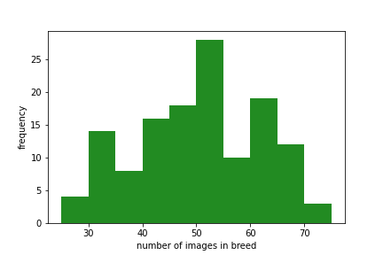

It can be seen that the 133 breeds are not evenly distributed. The bin that has the most frequency is 50-55, i.e., around 27 breeds have between 50 and 55 images. The breed that has the least data is *"Norwegian buhund"*, with 26 images, and the breed that has the most data is *"Alaskan malamute"*, with 77 images.

The task of assigning breed to dogs from images is considered exceptionally challenging.  To see why, consider that even a human would have great difficulty in distinguishing between a Brittany and a Welsh Springer Spaniel.  

| Brittany | Welsh Springer Spaniel |
| - | - |
|  |  |

It is not difficult to find other dog breed pairs with minimal inter-class variation (for instance, Curly-Coated Retrievers and American Water Spaniels).  

| Curly-Coated Retriever | American Water Spaniel |
| - | - |
|  |  |

Likewise, recall that labradors come in yellow, chocolate, and black.  The vision-based algorithm will have to conquer this high intra-class variation to determine how to classify all of these different shades as the same breed.  

| Yellow Labrador | Chocolate Labrador | Black Labrador |
| - | - | - |
|  |  |  |

We also mention that random chance presents an exceptionally low bar: setting aside the fact that the classes are slightly imabalanced, a random guess will provide a correct answer roughly 1 in 133 times, which corresponds to an accuracy of less than 1%.  

## 3. Methodology

* **Data Preprocessing**: When using [TensorFlow](https://www.tensorflow.org/) as backend, Keras CNNs require a 4D array (which we'll also refer to as a 4D tensor) as input, with shape `(nb_samples, rows, columns, channels)`, where `nb_samples` corresponds to the total number of images (or samples), and `rows`, `columns`, and `channels` correspond to the number of rows, columns, and channels for each image, respectively.  
Note that we need to resize each input image to a square image that is `224 x 224` pixels, convert it to an array, which is then resized to a 4D tensor.  In this case, since we are working with color images, each image has three channels.  Likewise, since we are processing a single image (or sample), the resulting tensor will always have shape `(1, 224, 224, 3)`. If we stack all input images together, the resulting tensor will take the size `(nb_samples, 224, 224, 3)`.  
When using `Transfer Learning`, however, we not only need to resize the input data as mentioned above, but also need to transfrom them into `bottleneck features`. In other words, we need to pass the resized data through the pre-trained neural network to obtain the output, i.e., the bottleneck features that are to be fed into newly added layers on top of the pre-trained model. 

* **Implementation**: The first CNN model we build is created from scrach. When train it using 10 epochs with the [Adam](https://arxiv.org/abs/1412.6980) optimizer to minimize the `Cross-Entropy` loss, this model gives a `4.3%` testing accuracy. The model architecture is shown below:  
    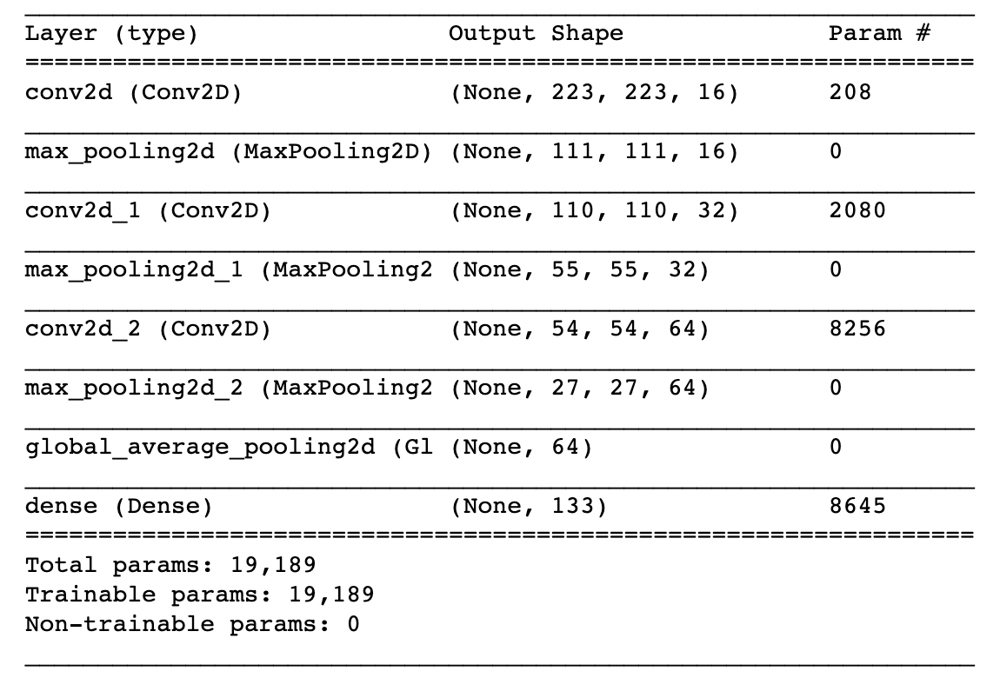  
    In this CNN, the first layer is a `convolutional layer`, which extracts the various features from the input image. In this layer, 16 convolution kernels is applied to the input, and the output is referred to as the Feature Map. The convolutional layer is usually followed by a `pooling layer`, which is primarily used to decrease the size of the convolved feature map hence reducing computational costs. Pooling methods include average pooling (smoothing out the image) and max pooling (extracting brighter pixels).  
    We repeat the above combination of the two layers 3 times to extract more features and increase model complexity. Given complex training data, we need correspondingly complex CNN structure to guarantee accuracy. But increasing the depth of a CNN may also cause overfitting, so we need to be careful with adding layers. Since the objective for this step is to create a model that has >1% testing accuracy, a simple CNN model like this would suffice.  
    The second to last layer is a `global pooling layer`, which reduces the dimensionality of the data from 3d to 1d. This transforms the data in preparation for the very last fully connected (dense) layer. The last layer is a `fully connected layer`. We specify the output size to be 133 since we need to map the data to exactly 133 categories. We apply the `softmax` activation function. This needs to be the last step of the CNN since it normalizes the output of a network to a probability distribution over predicted output classes. The class with the highest probability will be the predicted class.  

* **Refinement**: The model has only 4.3% testing accuracy when trained using 10 epochs. If we want to improve model accuracy, we need to increase model complexity and increase number of training epochs. Both of these requirement a long training time. An alternative we can consider is using `Transfer Learning`, which allows us to use pre-trained CNNs and train a few additional customized layers for our classficiation purpose. This greatly reduces training time. The idea is to first tranform training data to `bottleneck features` using the pre-trained CNN, and then feed these bottleneck features to train the additional customized layers, e.g.,   
    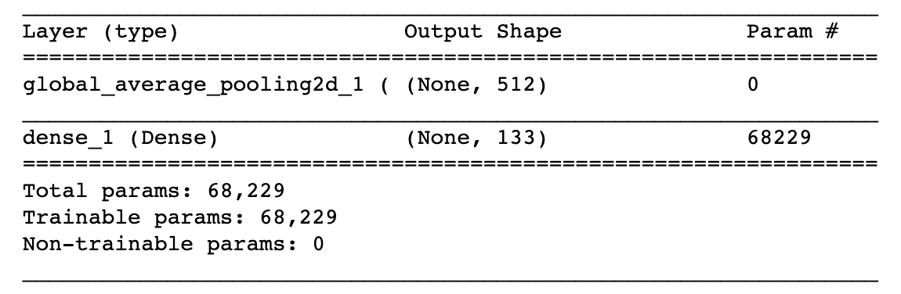   
    The reasoning behind adding these layers is that in order to obtain class probabilities, we first need a global pooling layer to transform the 3D output to 1D, and then a fully connected layer with SoftMax activation to map to the 133 dog breed classes for probabilities.  
    There are a number of pre-trained model we can use here, for example, [VGG16](https://keras.io/api/applications/vgg/#vgg16-function), [VGG19](https://keras.io/api/applications/vgg/#vgg19-function), [ResNet50](https://keras.io/api/applications/resnet/#resnet50-function), [InceptionV3](https://keras.io/api/applications/inceptionv3/), and [Xception](https://keras.io/api/applications/xception/). For a comparasion between these CNNS , you can check out [this blog post](https://towardsdatascience.com/the-w3h-of-alexnet-vggnet-resnet-and-inception-7baaaecccc96). In this project, we used both VGG16 and InceptionV3 to build transfer learning CNN models.

* **Algorithm**: Remember that the CNN model is only one part of the algorithm that we are building. The algorithm also has a human face detector and a dog detector to process the input. Here is the outline of the algorithm:
  * `If` dog is detected with dog detector: predict dog breed using CNN
  * `Else if` human face is detected with human face detector: predict resembling dog breed using CNN
  * `Else`: return error

  The dog detector we employed is [ResNet50](https://keras.io/api/applications/resnet/#resnet50-function). If the predicted label of the input image is between 151 and 268 (inclusive), then we say the model detects a dog. The human face detector we used is a [Cascade Classifier](https://docs.opencv.org/3.4/db/d28/tutorial_cascade_classifier.html).

        

## 4. Results

* **Model Evaluation and Validation**: We build 3 CNN models in total: 1) from sctach, 2) VGG16 with Transfer Learning (VGG16-TL), and 3) InceptionV3 with Tranfer Learning (InceptionV3-TL). For all models, the `Adam` optimizer is used to minimize the `Cross-Entropy` loss function. 20 training epoches are run on both Transfer Learning models that use the same additional layers, but only 10 epochs are run on the model built from scratch for training time consideration. During the training process, a model is generated at each epoch, and the model with the lowest validation loss is saved. The table below compares the testing accuracy of the 3 models. It can be seen that the `InceptionV3` CNN has the highest testing accuracy.

    | | From Scratch | VGG16-TL | InceptionV3-TL
    | - | - | - | - |
    | Optimizer | Adam | Adam | Adam |
    | Loss Function | Cross-Entropy | Cross-Entropy | Cross-Entropy |
    | Number of Epochs | 10 | 20 | 20 |
    | Testing Accuracy| 4.3062% | 69.3780% | 81.8182% |

* **Justification**: It is expected that the model created from scratch does not perform well for the reasons that 1) it is overly simple, and 2) it is not trained using enough epochs. According to the [Keras documentation](https://keras.io/api/applications/), the `InceptionV3` architecture has both higher top-1 accuracy (77.9%) and top-5 accuracy (93.7%) compared to `VGG16` (top-1: 71.3%, top-5: 90.1%) on the [ImageNet](https://www.image-net.org/) validation dataset. Hence, it is reasonable that our InceptionV3-TL model has a higher testing accuracy than the VGG16-TL model.

* **Examples**: 
  * Firstly, I want to test the algorithm on my own Maltese dog to see whether it can predict the breed correctly.
    | My Maltese | My Maltese |
    | - | - |
    | 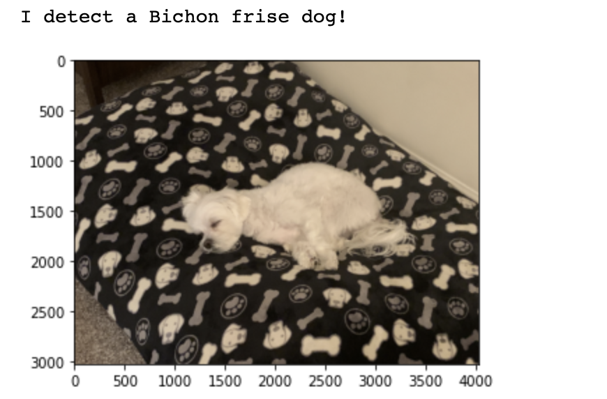  |   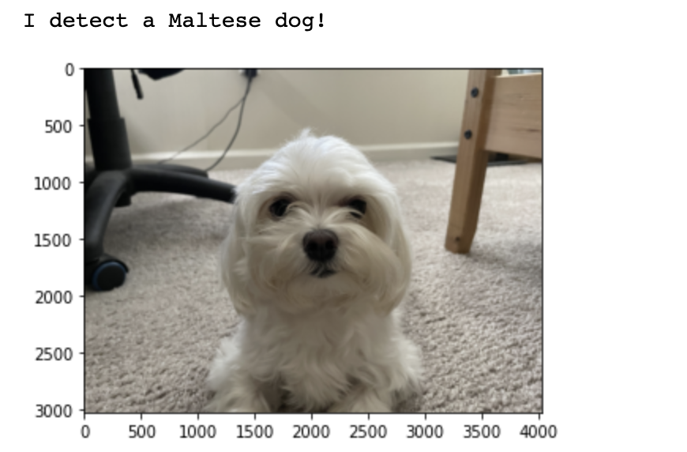 |

    For both photos, the algorithm is able to detect a dog. In the `left photo`, the code says my dog is a Bichon frise. Although the prediction is not correct, we do notice that at first sight the breed do look similar because of their white color. Although both are small dogs, Bichon frise is slightly larger and weighs about twice as Maltese. The size difference, however, is hard to be shown in photos.

    The biggest difference between the breeds is with their hair. Bichon frise has dense curly hair. In general, the breed has shorter hair, which gives the dog a very spongy appearance if trimmed and treated. On the other hand, Maltese has smooth, thin and straight hair that can grow very long, as shown in the picture below. The majority of the Maltese images in the training set are similar to this picture.

    | Bichon frise | Maltese |
    | - | - |
    | 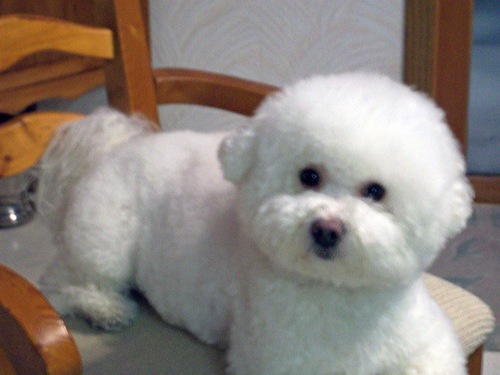 | 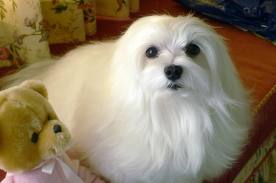 |

    However, if Maltese hair is groomed and trimmed, such as in the photo of my dog on the left, the difference between Bichon frise and Maltese is no longer very obvious. In the `right photo`, however, my dog's hair is left ungroomed for a while, which makes my dog look similar to the Maltese images in the training set. This time, the model is able to correctly predict the breed.

  * Next, I supply the model with another photo of my dog and a doge emoji. For both pictures, the algorithm is not able to detect a dog, i.e., ResNet50 does not label them as dogs so they are not passed to the CNN:
    | My Maltese | Emoji |
    | - | - |
    | 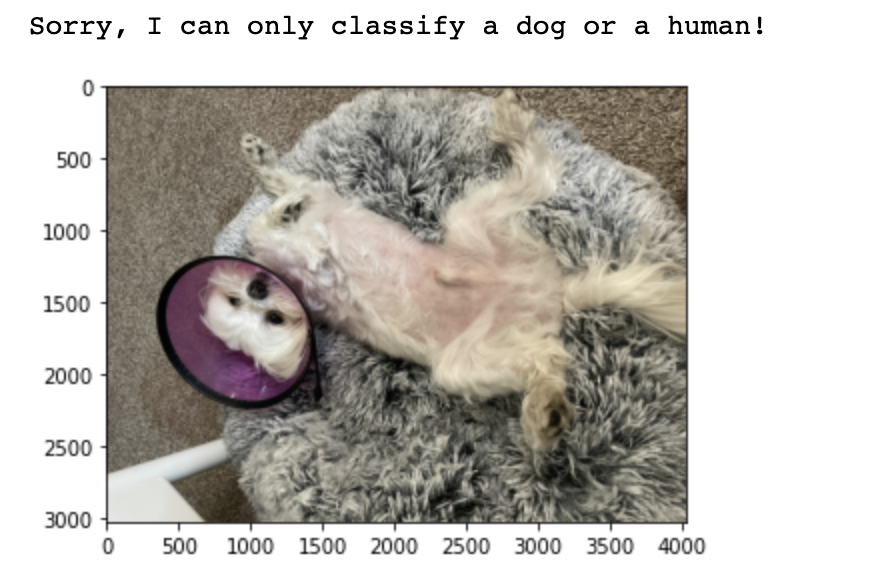 | 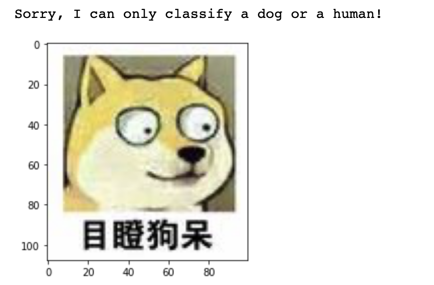 |

  * Lastly, I am also interested in how the model performs on human photos. Therefore, I feed it with my own photo and my boyfriend's photo. The human face detector correctly detects faces, and the CNN says we both look like Dachshunds. This is a very interesting result. In fact, the CNN model predicts Dachshunds for the majority of other human faces I feed to the algorithm.
    | Human 1 | Human 2 |
    | - | - |
    | 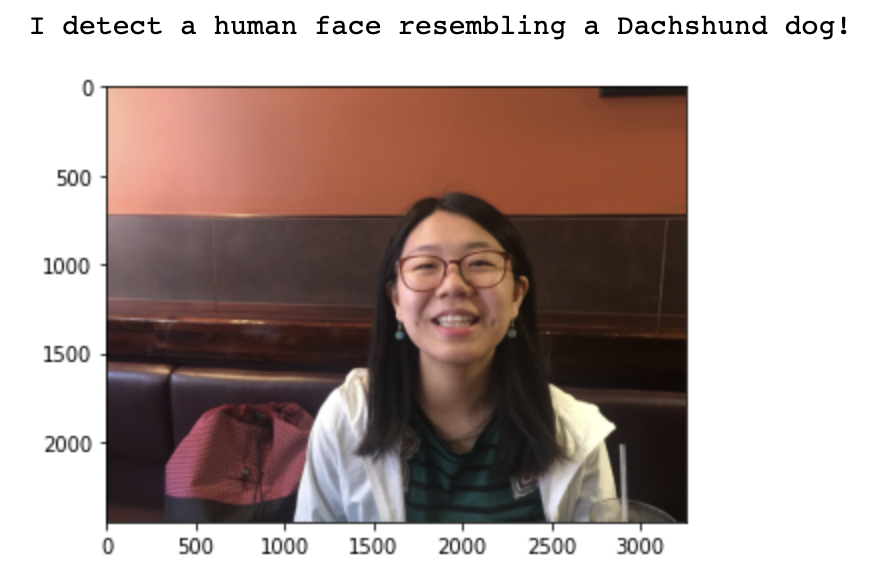  |   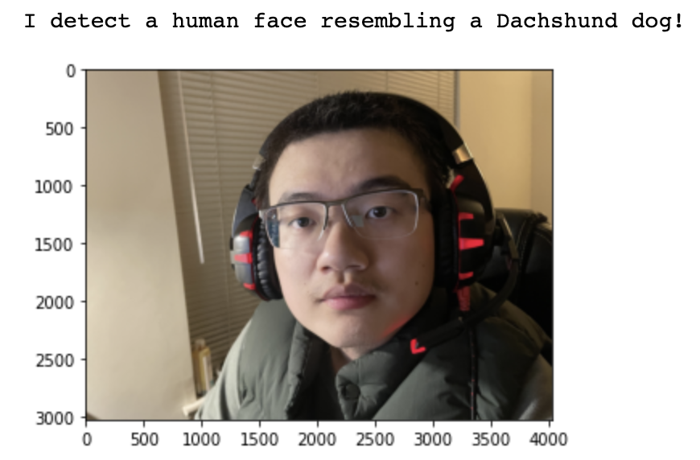 |

## 5. Conclusion

* **Reflection**: 

* **Improvement**: The model output is not so different from what I expected. At an accuracy rate of nearly 82% percent, I did not expect the dog classification results to be perfect -- there might be nuances that the model cannot capture. Regarding classification results for human, there is no way to evaluate whether they are correct or not, only subjective opinions.
To further improve the algorithm, there are a few things we could do:
  * Balance the categories of the training set may further improve the model. The training data set is not well balanced for some breeds, e.g., there are only 31 samples of Yorkshire terrier, but 75 samples of Border collie. 
  * Augment the training data set by adding synthetic data either through flipping images, adding noise, or other distortions. This will expose our model to more variations and generalize better on data it has not seen.
  * Use a different dog detector. The current dog detector is ResNet50, which is trained on images of 1000 categories. The model may be too complex for the simple task of detecting a dog. 