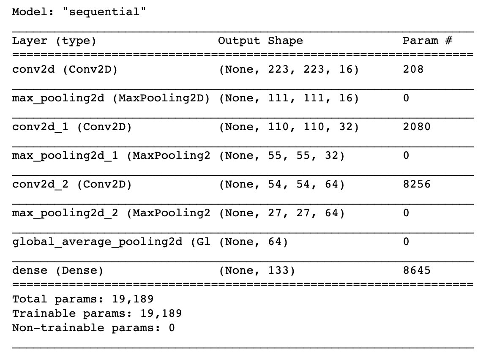

# Project Writeup

## Table of Contents
1. [Project Definition](#def)
2. [Analysis](#analysis)
3. [Methodology](#method)
4. [Results](#result)
5. [Conclusion](#conclusion)

## 1. Project Definition

* **Project Overview**: In this project, we build a model to process real-world, user-supplied images. Given an image of a dog, the algorithm will identify an estimate of the canine’s breed. If supplied an image of a human, the code will identify the resembling dog breed. The [dog dataset](https://s3-us-west-1.amazonaws.com/udacity-aind/dog-project/dogImages.zip) that the model will be trained on is provided by Udacity, which contains dog image data of 133 dog breeds split to train, validation and testing sets.

* **Problem Statement**: The algorithm we develop consists of three parts: a dog detector, a human face detector and a dog breed classifier. While we can use existing methods for detecting dog and human face, we will build a CNN for the purpose of dog breed classification. There are two ways of building a CNN: 1) construct from scratch, and 2) use Transfer Learning. Details of these two methods will be discussed later on.

* **Metrics**: We use accuracy score to measure the performance of our model, i.e., what percentage of data is correctly classified？ Since we are working on a multi-class classification problem with 133 classes, metrics that are frequently used for binary classification such as precision, recall and F1 score do not apply. Hence, we use the accuracy score only.

## 2. Exploratory Data Analysis

The training data consists of 6680 dog images belonging to 133 breeds. Firstly, I am interested in learning whether the breeds are evenly distributed, so I plotted a histogram of breed frequencies.

It can be seen that the 133 breeds are not evenly distributed. The bin that has the most frequency is 50-55, i.e., around 27 breeds have between 50 and 55 images. The breed that has the least data is "Norwegian buhund", with 26 images, and the breed that has the most data is "Alaskan malamute", with 77 images.

The task of assigning breed to dogs from images is considered exceptionally challenging.  To see why, consider that even a human would have great difficulty in distinguishing between a Brittany and a Welsh Springer Spaniel.  

| Brittany | Welsh Springer Spaniel |
| - | - |
|  |  |

It is not difficult to find other dog breed pairs with minimal inter-class variation (for instance, Curly-Coated Retrievers and American Water Spaniels).  

| Curly-Coated Retriever | American Water Spaniel |
| - | - |
|  |  |

Likewise, recall that labradors come in yellow, chocolate, and black.  The vision-based algorithm will have to conquer this high intra-class variation to determine how to classify all of these different shades as the same breed.  

| Yellow Labrador | Chocolate Labrador | Black Labrador |
| - | - | - |
|  |  |  |

We also mention that random chance presents an exceptionally low bar: setting aside the fact that the classes are slightly imabalanced, a random guess will provide a correct answer roughly 1 in 133 times, which corresponds to an accuracy of less than 1%.  

## 3. Methodology

* **Data Preprocessing**: When using TensorFlow as backend, Keras CNNs require a 4D array (which we'll also refer to as a 4D tensor) as input, with shape $(\mathrm{nb\_samples}, \mathrm{rows}, \mathrm{columns}, \mathrm{channels})$, where `nb_samples` corresponds to the total number of images (or samples), and `rows`, `columns`, and `channels` correspond to the number of rows, columns, and channels for each image, respectively.  
Note that we need to resize each input image to a square image that is $224 \times 224$ pixels, convert it to an array, which is then resized to a 4D tensor.  In this case, since we are working with color images, each image has three channels.  Likewise, since we are processing a single image (or sample), the resulting tensor will always have shape $ (1, 224, 224, 3)$. If we stack all input images together, the resulting tensor will take the size $(\mathrm{nb\_samples}, 224, 224, 3)$.
When using Transfer Learning, however, we not only need to resize the input data as mentioned above, but also need to transfrom them into `bottleneck features`. In other words, we need to pass the resized data through the pre-trained neural network to obtain the output, i.e., the bottleneck features that are to be fed into newly added layers on top of the pre-trained model. 

* **Implementation**: The first CNN model I built was created from scrach. When trained using 10 epochs with the Adam optimizer, this model gives up testing accuracy of 4.3%. The model architecture is shown below:   
  
In this CNN, the first layer is a convolutional layer, which extracts the various features from the input image. In this layer, several convolution kernels is applied to the input, and the output is referred to as the Feature Map.  
The convolutional layer is usually followed by a pooling layer, which is primarily used to decrease the size of the convolved feature map hence reducing computational costs. Pooling methods include average pooling (smoothing out the image) and max pooling (extracting brighter pixels).  
We repeat the above combination of the two layers 3 times to extract more features and increase model complexity. Given complex training data, we need correspondingly complex CNN structure to guarantee accuracy. But increasing the depth of a CNN may also cause overfitting, so we need to be careful with adding layers. Since the objective for this step is to create a model that has >1% testing accuracy, a simple CNN model like this would suffice.  
The second to last layer is a global pooling layer, which reduces the dimensionality of the data from 3d to 1d. This transforms the data in preparation for the very last fully connected (dense) layer.  
The last layer is a fully connected layer. We specify the output size to be 133 since we need to map the data to exactly 133 categories. We apply the softmax activation function. This needs to be the last step of the CNN since it normalizes the output of a network to a probability distribution over predicted output classes. The class with the highest probability will be the predicted class.  

* **Refinement**:

## 4. Results

* **Model Evaluation and Validation**:

* **Justification**:

## 5. Conclusion

* **Reflection**:

* **Improvement**: